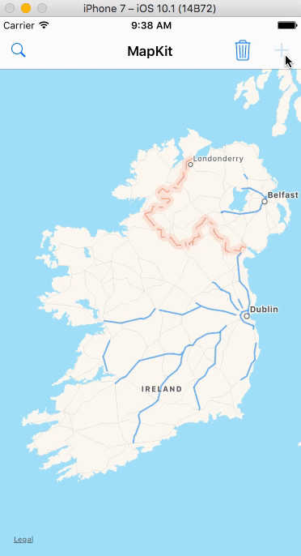

# MapKitTest

>A sample application with MapView.

AnnotationView object are generated with random coordinates and personal information.

An accessoryView of every object has a button which presents a DescriptionViewController (modally on iPhone devices and using popover controller on iPad).

CLGeocoder is implemented to get an address of a view in its location on the mapView.

